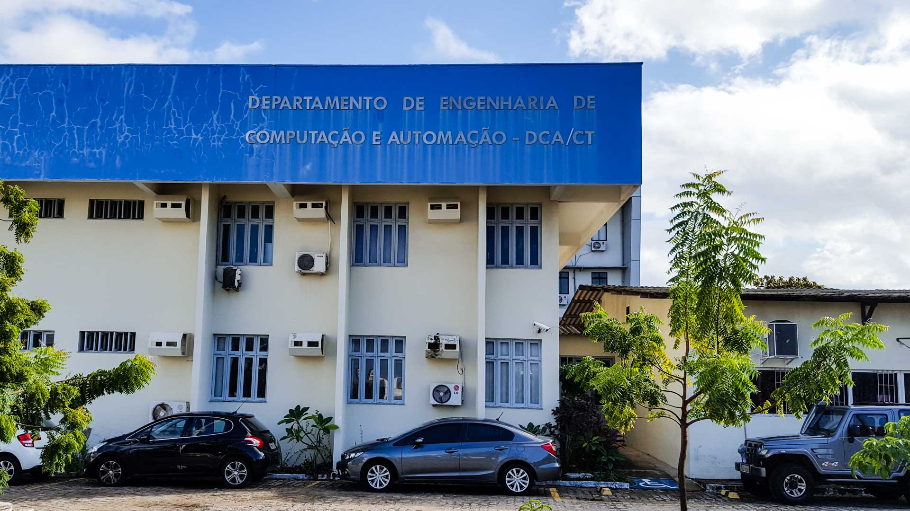

# Federal University of Rio Grande do Norte (UFRN)
## Technology Center
### Department of Computer Engineering and Automation (DCA)
#### Laboratory of Parallel Architectures for Signal Processing (LAPPS)

<left></left> <right></right>

#### Invited Researcher: Prof. Dr. Victor Rafael R. Celestino - ADM/FACE - University of Brasilia (UnB)
- :Lattes: http://lattes.cnpq.br/6704883902846881
- :UnB: http://pesquisar.unb.br/professor/victor-rafael-rezende-celestino
- :ResearchGate: https://www.researchgate.net/profile/Victor_Celestino

#### References

- :books: Roman Trobec, et al. Introduction to Parallel Computing: From algorithms to programming state-of-the-art platforms [[Link]](https://link.springer.com/book/10.1007/978-3-319-98833-7/)

#### Research Projects

**mip_hpc_2023**: Mixed integer programming with high-performance computing technical visit as invited research to LAPPS/DCA/UFRN
- :activities:
